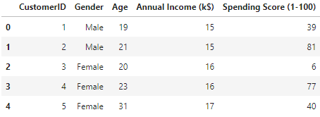
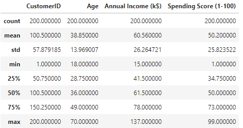
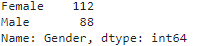
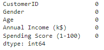
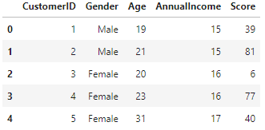
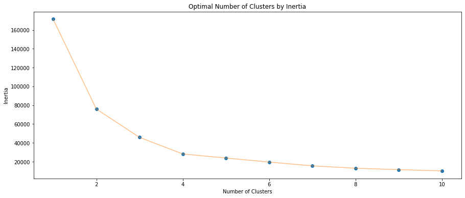
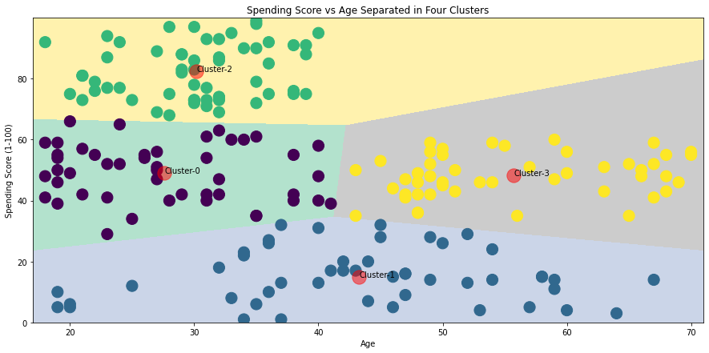
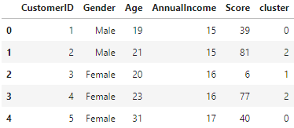
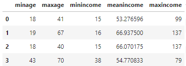

Visualising KMeans Clusters
========================

This project is designed to break down an analysis of a customer dataset and finish with using KMeans to partition the data into distinct customer groups.

<pre><code class="language-python">
%matplotlib inline
import numpy as np # linear algebra
import pandas as pd # data processing
import matplotlib.pyplot as plt 
import seaborn as sns 
import plotly as py
import plotly.graph_objs as go
from sklearn.cluster import KMeans
import warnings
import os
warnings.filterwarnings("ignore")
</code></pre>

<h1 id="dt-exploration"></h1>
## Data Exploration

Firstly we have to look at the data. The dataset comes from Kaggle and is called Mall Customer Segmentation Data. It is a dataset created for learning customer segmentation practices. The data set contains only five columns.

- Customer ID
- Gender
- Age
- Annual Income
- Spending Score

<pre><code class="language-python">
df = pd.read_csv("Mall_Customers.csv")
df.head()
</code></pre>

<pre><code class="language-python">
df.describe()
</code></pre>

Above I have shown a little sample of the data. Firstly, I use pd.describe() to make sure there are no immediate issues in the data. Age appears to be within reasonable limits, Annual income contains no 0 values, and the max is sensible. Finally the spending score is confirmed as a range between 1-100. Gender is left out of the describe function so I take a quick look at it seperately below.

<pre><code class="language-python">
df.Gender.value_counts()
</code></pre>

<pre><code class="language-python">
df.isnull().sum()
</code></pre>

No incorrect categories, and the formatting is the same which is good. This is to be expected with a heavily used Kaggle dataset where the aim of this project is not data cleaning.

A great library that can be used to give a quick overview of the data is Pandas Profiling which provides a quick dive into a dataframe.

<pre><code class="language-python">
df = df.rename(columns={'Annual Income (k$)': 'AnnualIncome', 'Spending Score (1-100)': 'Score'})
df.head()
#import pandas_profiling
#df.profile_report()
</code></pre>

<h1 id="kmeans"></h1>

## K-Means

<h1 id="segmentation"></h1>

### Segmentation using Age and Spending Score
Firstly to visualise our data I select two features, age and spending score. The cost method used to determine which inputs are optimal is Inertia. It is calculated by measuring the distance between each data point and its centroid, squaring this distance, and summing these squares across one cluster. A good model looks for low inertia as well as a low k number. As such the elbow method is used to determine which number of clusters is optimal.

The code below runs for the values of Age and Spending score the KMeans Clustering for clusters 1-10. For each of these the level of inertia is stored.

<pre><code class="language-python">
'''Age and spending Score'''
X1 = df[['Age' , 'Score']].iloc[: , :].values
inertia = []
for n in range(1 , 11):
    algorithm = (KMeans(n_clusters = n ,init='k-means++', n_init = 10 ,max_iter=300, 
                        tol=0.0001,  random_state= 111  , algorithm='elkan') )
    algorithm.fit(X1)
    inertia.append(algorithm.inertia_)
</code></pre>

Then we can plot each iteration and the corresponding inertia value.

<pre><code class="language-python">
plt.figure(1 , figsize = (15 ,6))
plt.plot(np.arange(1 , 11) , inertia , 'o')
plt.plot(np.arange(1 , 11) , inertia , '-' , alpha = 0.5)
plt.xlabel('Number of Clusters') , plt.ylabel('Inertia')
plt.title('Optimal Number of Clusters by Inertia')
plt.show()
</code></pre>

The graph shows that Inertia falls rapidly until it meets 4 clusters and then slows down on how quickly it falls. As such we choose 4 clusters as optimal. We use this below to create our final algorithm

<pre><code class="language-python">

algorithm = (KMeans(n_clusters = 4 ,init='k-means++', n_init = 10 ,max_iter=300, 
                    tol=0.0001,  random_state= 111  , algorithm='elkan') )
algorithm.fit(X1)
labels1 = algorithm.labels_
centroids1 = algorithm.cluster_centers_
print(centroids1)
</code></pre>

[[27.61702128 49.14893617]  
 [43.29166667 15.02083333] 
 [30.1754386  82.35087719] 
 [55.70833333 48.22916667]]

 Now that we have the algorithm confirmed we can set up the data ready for plotting. For reusable code we create a numpy meshgrid using the min and max values of both the age and spending score values increasing by 0.02 to create a large np.array of values. These will then be used to colour the background of the KMeans diagram.

The function .predict() calls upon our algorithm and uses it to predict the closest cluster for each of the values in our xx and yy arrays storing the values in Z. For the .predict to work an array with two values must be passed in. That is the function of the np.c() and .ravel() numpy functions. .ravel() turns the array into a list and .c combines the two lists pairing of the items to be passed to predict.

<pre><code class="language-python">
h = 0.02
x_min, x_max = X1[:, 0].min() - 1, X1[:, 0].max() + 1
y_min, y_max = X1[:, 1].min() - 1, X1[:, 1].max() + 1
xx, yy = np.meshgrid(np.arange(x_min, x_max, h), np.arange(y_min, y_max, h))
Z = algorithm.predict(np.c_[xx.ravel(), yy.ravel()]) 
</code></pre>

Now that we have all of the predictions we need to reorganise them. We start by reforming the predictions back into an array the same shape as xx. Then we use plt.imshow to create the background with the regions defined by different colours. We then add our original points colouring them based on their assigned cluster and finally, plot the centroid points.

<pre><code class="language-python">
plt.figure(1 , figsize = (15 , 7) )
plt.clf()
Z = Z.reshape(xx.shape)

annotations=["Cluster-0","Cluster-1","Cluster-2","Cluster-3"]

plt.imshow(Z , interpolation='nearest', 
           extent=(xx.min(), xx.max(), yy.min(), yy.max()),
           cmap = plt.cm.Pastel2, aspect = 'auto', origin='lower')

plt.scatter( x = 'Age' ,y = 'Score' , data = df , c = labels1 , s = 200 )
plt.scatter(x = centroids1[: , 0] , y =  centroids1[: , 1] , s = 300 , c = 'red' , alpha = 0.5)
plt.ylabel('Spending Score (1-100)') , plt.xlabel('Age')
plt.title('Spending Score vs Age Separated in Four Clusters')

for i, label in enumerate(annotations):
    plt.annotate(label, (centroids1[: , 0][i], centroids1[: , 1][i]))

plt.show()
</code></pre>

As we can see above we achieve a lovely breakdown of each cluster and their split points. If we now append the list of clusters to our original dataframe we can begin to analyse further each customer with the option of splitting customers into separate groups.

<pre><code class="language-python">
x1 = pd.DataFrame(X1)
df['cluster'] = labels1
df.head()
</code></pre>

<h1 id="analysingClusters"></h1>

## Analysing Clusters

As mentioned once clusters have been assigned any form of separated analysis is available. Below we have simply calculated the min and max age of each group, as well as the min, mean and max income. It can be clear from the information that there is a sub category of older individuals who have a higher minimum income but the lowest max income of any group.

<pre><code class="language-python">
minage = []
maxage = []
minincome = []
maxincome = []
meanincome = []

for i in range(0, 4):
    minage.append(df.loc[df.cluster == i].Age.min())
    maxage.append(df.loc[df.cluster == i].Age.max())
    minincome.append(df.loc[df.cluster == i].AnnualIncome.min())
    meanincome.append(df.loc[df.cluster == i].AnnualIncome.mean())
    maxincome.append(df.loc[df.cluster == i].AnnualIncome.max())

sumdata = pd.DataFrame({'minage': minage, 'maxage': maxage, 'minincome': minincome, 
                        'meanincome': meanincome, 'maxincome': maxincome})
sumdata.head()
</code></pre>

