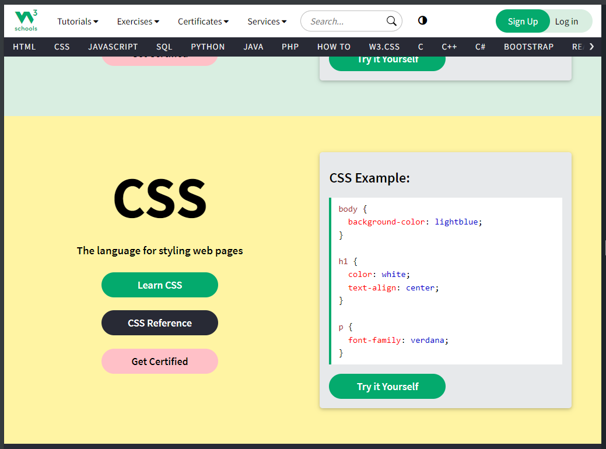

Fixing the Navbar Without Using Padding
============================================

## Fixed Navbar 
A common styling choice for websites a fixed navbar involves having the navbar appear fixed to the top of the screen no matter where you scroll. 
Here you can see how the site https://www.w3schools.com/ has fixed its homepage nav bar

<h1 id="classic-nav"></h1>

## How to create a fixed Navbar
The typical tutorial online will involve using position fixed on the navbar element and then adding padding to each element below. Below is a typical css styling for this

<pre><code class="language-css">
.navbar {
    overflow: hidden;
    position: fixed; /* Fixed position */
    top: 0; /* Stick to the top */
    width: 100%; /* Full width */
    z-index: 1000; /* Ensure it stays on top */
}
</code></pre>

<h1 id="scrollable-nav"></h1>

## Fix Navbar Using Scrollable Area
However, when trying to build this website I encountered a novel solution that allowed me to fix the navbar itself without adding padding to other elements.

I got the idea to add the navbar as an element and make the rest of the page scrollable from a <a href="https://www.reddit.com/r/webdev/comments/jhgjmu/fixed_navbar_without_using_position_fixed/"  target="_blank">reddit post</a>

Like the post says the solution appears cleaner and means if you have multiple elements along the top (as the pages on this site do) you don't have to worry about ensuring padding is right on each section.

It also helps to make the code a little neater and easier to maintain given that the height of the navbar can be changed in just one location rather than having to change multiple elements with different padding.

To do this only requires a small bit of CSS!

My navbar uses this styling 

<pre><code class="language-css">
nav {
    background-color: #012030;
    width: 100%;
    height: 50px;
    display: flex;
}
</code></pre>

And then on the main body section of each page I also add this

<pre><code class="language-css">
.main-scrollable {
    height: calc(100vh - 50px);
    overflow: auto;
    min-height: calc(100vh - 50px);
}
</code></pre>

This ensures a minimum height for each page and also sets the scrollable area.
