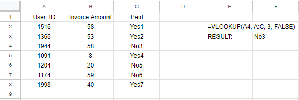

Use XLOOKUP Not VLOOKUP
========================

VLOOKUP and HLOOKUP have been a part of Excel since it launched in 1985.
According to Microsoft Data, it is the third most used function after SUM and AVERAGE

However, XLOOKUP introduced in 2022 is a cleaner more versatile function that this article will show

## VLOOKUP()
VLOOKUP stands for "Vertical Lookup" and its purpose is to find a specific value in a table's first column,
returning the corresponding position in another column. 

Below is a basic example of how VLOOKUP works. There is a table with three columns. 
You search for a user_id in the first column to return whether they have paid in the third column.

>=VLOOKUP(A4, A:C, 3, FALSE)

- search_key: A4 is the value you are trying to find in the first column of the range
- range: A:C means the range is each column from column A up to and including column C
- index: 3 this means search in the third column, i.e. column C
- match: specifies and exact match

**Limitations of VLOOKUP()**

- It only searches in one direction of travel. left to right.
- It is memory intensive. to search it must load the entire range before indexing
- It is not case sensitive, meaning upper and lower case are matched the same
- Must be swapped to HLOOKUP for horizontal searches

## XLOOKUP()
This function is not only more flexible and more intuitive but it solves some issues of VLOOKUP as well.

The formula looks like this

>=XLOOKUP(search_key, lookup_range, result_range, [missing_value], [match_mode], [search_mode])

- search_key: The value to search for. For example, '42', "Cats" or 'I24'.
- lookup_range: The range to consider for the search. This range must be a singular row or column.
- result_range: The range to consider for the result. This range's row or column size should be the same as the lookup_range's, depending on how the look-up is done.
- missing_value (optional): The value to return if no match is found. If unspecified, an error is returned.
- match_mode (optional): Determines the match type — exact match, partial match, etc.
- search_mode (optional): Defines how to handle different types of matches.

**Advantages of XLOOKUP**

- Easier to implement: Rather than selecting whole ranges, select a lookup range and a result range, no more counting columns!
- Handling errors: The function has error handling built in allowing you to either hide or flag errors quicker
- Bidirectional lookup: XLOOKUP works both vertically as well as horizontally
- Multiple criteria: It supports passing multiple criteria allowing for more complex searches

## XLOOKUP() Example

Recreating the example from above would look like this below

The search key remains A4, User_ID = 1944. Now we search for this in column A:A and return the corresponding value in column C:C.

Again to highlight some of the benefits again. We simply choose which column to lookup the value in rather than count columns. We can show another benefit quickly by adding a column to the table.

In the example below we added another column to convert the currency from GBP to USD. As you can see the VLOOKUP now shows the incorrect value while the XLOOKUP is correct. This is because, the VLOOKUP simply is returning column 3, while the XLOOKUP is locked onto the Paid column. This issue could be fixed using a MATCH() function in the VLOOKUP, but the XLOOKUP by default proves to be much more robust to sheet changes. 